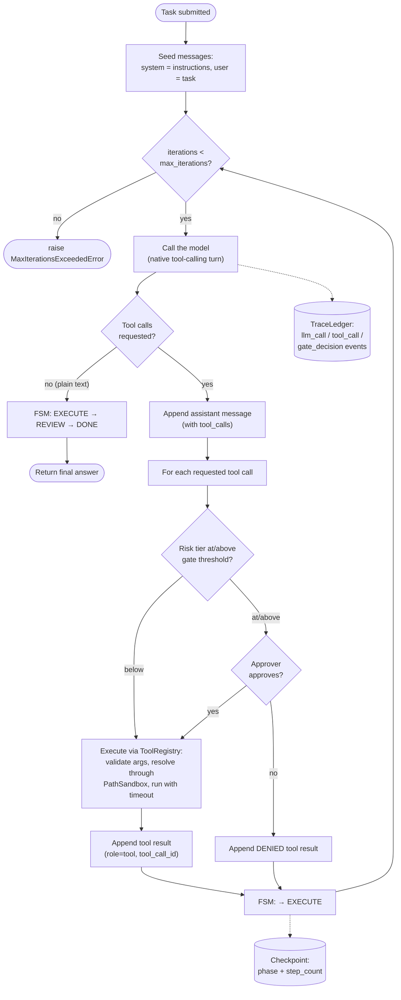
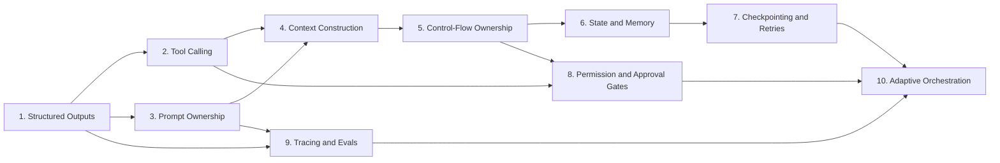

# Agent Harness — Architecture

A from-scratch, production-grade agent harness built across 10 core
Agent-Harness Design Patterns: structured outputs, tool calling, prompt
ownership, context construction, control-flow ownership, state & memory,
checkpointing & retries, permission & approval gates, tracing & evals, and
adaptive orchestration.

The organizing principle across all ten: **the harness owns control flow,
the model only proposes.** Every decision the model makes — call a tool,
declare itself done, transition state — passes through a harness-owned
module that validates, gates, logs, or rejects it before it takes effect.
No LangChain/LlamaIndex/AutoGen — raw OpenAI API calls + `pydantic`, so the
mechanics are explicit rather than hidden behind a framework.

This document describes the system as it actually works today. For what's
still missing to call it truly production-ready, see
`docs/production_readiness_todo.md`.

## How a task flows through the harness

Everything below is one loop, driven by `AgentHarness.run()`
(`agent_harness/framework.py`). The model is a normal multi-turn chat
participant: each turn it either requests tool calls (validated by the
provider against each tool's own schema) or replies with plain text, which
the harness treats as the final answer.



A few things worth reading directly off this diagram:

- **The `messages` list is the only source of truth.** It's seeded once
  (`system` = harness instructions, `user` = the task) and grows for the
  whole run — the model's own tool-call request and the tool's result are
  both appended, linked by `tool_call_id`. There's no separate paraphrased
  history to keep in sync with it.
- **"Final answer" is structural, not self-reported.** The model never says
  "I'm done" in a field the harness has to trust — the absence of
  `tool_calls` in the response *is* the done signal.
- **Every tool call passes through the same gate**, regardless of which
  tool it is: look up its `RiskTier`, and if that's at or above the
  configured threshold, block on `ApprovalGate` before `ToolRegistry.execute`
  ever runs.
- **Tracing and checkpointing are side effects of the loop, not steps in
  it** — they attach after every model call and after every state
  transition, not conditionally.
- **The step budget is a hard ceiling**, not a suggestion: `AgentFSM`'s own
  `max_steps` guard (separate from `max_iterations` here) raises if the FSM
  itself is driven past its limit.

## Package layout

```
agent_harness/
├── framework.py         # AgentHarness -- the loop diagrammed above
├── schemas/
│   ├── structured.py     # generate_structured(): text -> validated pydantic, with repair
│   ├── actions.py         # AgentAction/ActionType -- superseded for tool selection, see below
│   ├── tool_calling.py     # ToolCallingChatClient protocol, ChatTurn, ToolCallRequest
│   └── openai_client.py     # the only file that imports the `openai` SDK
├── tools/
│   ├── registry.py        # ToolRegistry: schema derivation, arg validation, sandboxed execution
│   ├── filesystem.py       # read/write/list/glob/grep/stat/mkdir/move/delete
│   └── sandbox.py           # PathSandbox: confines every tool path to a root
├── prompts/template.py    # PromptTemplate/PromptRegistry -- built, not yet wired in (see gaps)
├── context/                # ContextBuilder/count_tokens -- built, not yet wired in (see gaps)
├── control_flow/state_machine.py   # AgentFSM
├── memory/
│   ├── sliding_window.py    # no longer used by the live loop (see Module 6 below)
│   ├── durable_store.py      # built, not yet wired in (see gaps)
│   └── vector_memory.py       # built, not yet wired in (see gaps)
├── persistence/
│   ├── checkpoint.py        # save_checkpoint/load_checkpoint
│   └── retry.py               # with_backoff, FatalError
├── gates/approval.py       # RiskTier, ApprovalGate, PendingAction
├── tracing/
│   ├── ledger.py             # TraceLedger, TraceEvent
│   └── judge.py                # LLMJudge
└── orchestration/
    ├── router.py             # ModelRouter -- built, not yet composed into a driver (see gaps)
    └── spawner.py              # SubAgentSpawner -- same
```

## Module reference

### 1. Structured Outputs — `schemas/structured.py`, `schemas/actions.py`

`generate_structured()` turns raw model text into a validated Pydantic
object: it asks for JSON matching a schema, and on `ValidationError` feeds
the exact error back to the model in a bounded repair loop rather than
failing on the first malformed response. This was originally also how the
agent loop picked tools — the model would emit an `AgentAction` JSON object
with a `tool_name`/`tool_args` field — but that's been superseded by native
tool-calling (see the flow diagram and the design note below). It's still
the general-purpose mechanism for other structured needs, e.g. `LLMJudge`'s
numeric score in Module 9.

Tested in `tests/test_module_01_structured_outputs.py`.

### 2. Tool Calling — `tools/registry.py`, `tools/filesystem.py`, `tools/sandbox.py`

`ToolRegistry.tool` derives a Pydantic argument model from a plain
function's type hints — no hand-written JSON schema to drift out of sync.
`execute()` validates the model-supplied args against it, runs the function
in a thread pool with a timeout, and always returns a
`ToolExecutionResult(ok, result, error)` — a tool can never raise across
this boundary. The filesystem tools (`read_file`, `write_file`,
`list_files`, `glob_files`, `grep_files`, `file_stat`, `make_directory`,
`move_file`, `delete_file`) resolve every path through a `PathSandbox`
first, which normalizes the path with `Path.resolve()` (collapsing `..` and
following symlinks in one step) and rejects anything that lands outside the
configured root.

Tested in `tests/test_module_02_tool_calling.py`, `tests/test_filesystem_tools.py`.

### 3. Prompt Ownership — `prompts/template.py`

`PromptTemplate`/`PromptRegistry` give prompts a name, a version, and strict
variable substitution (a missing variable fails loudly, naming the exact
prompt and version, instead of silently blanking). **Not currently wired
in** — the harness's real instructions live as raw f-strings in
`run_agent.py`. See `docs/production_readiness_todo.md`.

Tested in `tests/test_module_03_prompt_ownership.py`.

### 4. Context Construction — `context/builder.py`, `context/tokens.py`

`ContextBuilder` assembles prioritized text blocks into one budgeted
string, dropping the lowest-priority blocks whole (never mid-sentence) once
a token budget is exceeded. **Not currently wired in** — the native
tool-calling `messages` list has no budget enforcement today, so it grows
unbounded. See `docs/production_readiness_todo.md`.

Tested in `tests/test_module_04_context_construction.py`.

### 5. Control-Flow Ownership — `control_flow/state_machine.py`

`AgentFSM` enforces the legal phase graph —
`PLAN → EXECUTE → {REVIEW, EXECUTE} → {EXECUTE, DONE, FAILED}` — plus a hard
`max_steps` guard independent of what the model wants to do. The model's
output is a *proposal*; `AgentFSM.step()` is the only thing that actually
advances state, and raises on an illegal transition or an exceeded step
budget rather than allowing it silently.

Tested in `tests/test_module_05_control_flow.py`.

### 6. State and Memory — `memory/`

`SlidingWindowMemory` is no longer used by the live loop: once tool calls
became native, the real `messages` list already carries full turn-by-turn
history (tool requests and results linked by `tool_call_id`), which made
the separate paraphrased memory log redundant — keeping both in sync would
have been pure risk for no benefit. `DurableStateStore` (crash-durable
key-value facts) and `VectorMemory` (semantic retrieval) are both fully
built and independently tested but not wired into the harness at all yet.
See `docs/production_readiness_todo.md`.

Tested in `tests/test_module_06_memory.py`.

### 7. Checkpointing & Safe Retries — `persistence/`

`with_backoff()` wraps every model call with exponential backoff + jitter,
re-raising immediately on `FatalError` instead of retrying it — though
nothing in production code raises `FatalError` today, so a bad API key
currently gets retried like any transient failure. `save_checkpoint()` runs
after every step in the diagram above, but only records `{phase,
step_count}` — `load_checkpoint()` exists but nothing calls it, so a crash
mid-run can't actually resume yet. See `docs/production_readiness_todo.md`.

Tested in `tests/test_module_07_checkpointing.py`.

### 8. Permission & Approval Gates — `gates/approval.py`

`RiskTier` (`LOW < MEDIUM < HIGH`) is assigned per tool name at harness
construction (`risk_by_tool` in `run_agent.py`). `ApprovalGate.check()`
auto-approves anything below `require_approval_at` and defers everything
else to an `approver` callback — a blocking CLI prompt by default, an
auto-approve function for non-interactive runs. This is the gate/approve
branch in the flow diagram above.

Tested in `tests/test_module_08_approval_gates.py`.

### 9. Tracing & Evals — `tracing/`

`TraceLedger` appends one JSON line per `llm_call`/`tool_call`/
`gate_decision` event, and `total_cost()` sums `cost_usd` across a run's
events. In production that sum is always `0.0` today — nothing populates
`cost_usd`/`tokens_in`/`tokens_out` from the real API response yet. See
`docs/production_readiness_todo.md`. `LLMJudge` scores a finished
trajectory against a rubric, reusing `generate_structured` from Module 1.

Tested in `tests/test_module_09_tracing_evals.py`.

### 10. Adaptive Orchestration — `orchestration/`

`ModelRouter` picks a model tier from estimated difficulty and prior
failure count, capped at the top tier no matter how many failures pile up.
`SubAgentSpawner` runs a DAG of sub-tasks across a bounded thread pool, each
as its own harness instance. Neither is composed into a real multi-agent
driver yet — `AgentHarness.run()` doesn't even accept a `run_id` override,
which a real spawner would need to give each sub-agent its own trace file.
See `docs/production_readiness_todo.md`.

Tested in `tests/test_module_10_orchestration.py`.

## Design decisions worth calling out

**Native tool-calling over a hand-rolled JSON action schema.** The harness
originally had the model emit one JSON object (`reasoning`, `action_type`,
`tool_name`, `tool_args`) validated against a schema — Module 1's repair
loop, repurposed for control flow. That broke down once the model also
needed to know what tools existed: exposing tool schemas via OpenAI's
native `tools=` parameter *while also* forcing `response_format=json_object`
made the model drift into native-tool-calling artifacts inside the JSON
text (a `tool_name` prefixed `"functions."`, and once an `action_type`
value borrowed from OpenAI's own parallel-tool-call format that isn't even
in the schema) — and kept it re-invoking a tool even after the task was
already done, since nothing in that mixed signal ever cleanly meant "stop."
Switching to the provider's real tool-calling collapses this into two clean
channels: a `tool_calls` response the API itself validates per-tool, or
plain text treated as the final answer.

**Filesystem tools are sandboxed by construction.** A single containment
check (`resolved.is_relative_to(root)`, after `Path.resolve()`) catches both
a `../` traversal and a symlink planted inside the root that points
outside it, because `resolve()` normalizes both in one step. No tool needs
its own escape handling — `PathSandbox.resolve()` raises, and
`ToolRegistry.execute`'s blanket exception handling turns that into a
structured `ok=False` result like any other tool failure.

## Module dependency graph

Build order was roughly 1→10, but the real dependencies are narrower than a
strict chain:



1-3 are the typed I/O contracts (structured outputs, tool safety, versioned
prompts) everything else assumes. 4-5 turn those into an actual reasoning
loop with a context budget and deterministic control. 6-7 make the loop
stateful and crash-resilient. 8-9 add safety and observability, both only
meaningful once a real loop exists to gate or watch. 10 is the capstone:
it composes the whole harness as the unit it routes between model tiers and
spawns copies of.

## Known gaps

Every module above passes its own test in isolation — that's not the same
as the whole system being safe to run unattended against real work.
`docs/production_readiness_todo.md` tracks that gap in full, prioritized
detail. The two most load-bearing items:

- **Unbounded context growth** — the `messages` list in the flow diagram
  has no token-budget check, so a long-running task will eventually exceed
  the model's context window.
- **Checkpoint resume doesn't actually work** — `load_checkpoint()` is
  never called anywhere; a crash mid-run currently loses everything.
