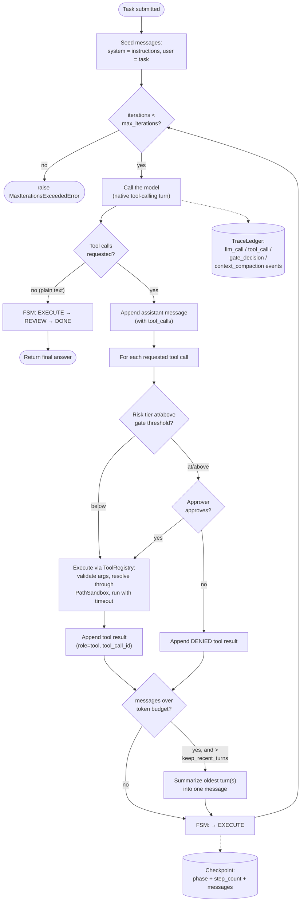
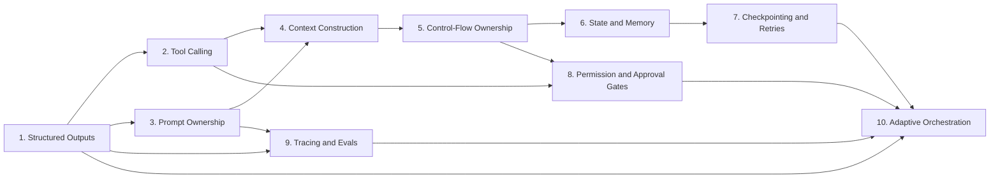

# Agent Harness — Architecture

A from-scratch, production-grade agent harness built across 10 core
Agent-Harness Design Patterns: structured outputs, tool calling, prompt
ownership, context construction, control-flow ownership, state & memory,
checkpointing & retries, permission & approval gates, tracing & evals, and
adaptive orchestration.

The organizing principle across all ten: **the harness owns control flow,
the model only proposes.** Every decision the model makes — call a tool,
declare itself done, transition state — passes through a harness-owned
module that validates, gates, logs, or rejects it before it takes effect.
No LangChain/LlamaIndex/AutoGen — raw OpenAI API calls + `pydantic`, so the
mechanics are explicit rather than hidden behind a framework.

This document describes the system as it actually works today. For what's
still missing to call it truly production-ready, see
`docs/production_readiness_todo.md`.

## How a task flows through the harness

Everything below is one loop, driven by `AgentHarness.run()`
(`agent_harness/framework.py`). The model is a normal multi-turn chat
participant: each turn it either requests tool calls (validated by the
provider against each tool's own schema) or replies with plain text, which
the harness treats as the final answer.



A few things worth reading directly off this diagram:

- **The `messages` list is the only source of truth.** It's seeded once
  (`system` = harness instructions, `user` = the task) and grows for the
  whole run — the model's own tool-call request and the tool's result are
  both appended, linked by `tool_call_id`. There's no separate paraphrased
  history to keep in sync with it.
- **"Final answer" is structural, not self-reported.** The model never says
  "I'm done" in a field the harness has to trust — the absence of
  `tool_calls` in the response *is* the done signal.
- **Every tool call passes through the same gate**, regardless of which
  tool it is: look up its `RiskTier`, and if that's at or above the
  configured threshold, block on `ApprovalGate` before `ToolRegistry.execute`
  ever runs.
- **Tracing and checkpointing are side effects of the loop, not steps in
  it** — they attach after every model call and after every state
  transition, not conditionally.
- **Context compaction is a budget check on every iteration, not a
  reaction to failure.** The loop never waits for a context-length error
  from the API — it counts tokens itself and condenses old turns away
  before that could happen.
- **The step budget is a hard ceiling**, not a suggestion: `AgentFSM`'s own
  `max_steps` guard (separate from `max_iterations` here) raises if the FSM
  itself is driven past its limit.

## Package layout

```
agent_harness/
├── framework.py         # AgentHarness -- the loop diagrammed above
├── schemas/
│   ├── structured.py     # generate_structured(): text -> validated pydantic, with repair
│   ├── actions.py         # AgentAction/ActionType -- superseded for tool selection, see below
│   ├── tool_calling.py     # ToolCallingChatClient protocol, ChatTurn, ToolCallRequest
│   └── openai_client.py     # the only file that imports the `openai` SDK
├── tools/
│   ├── registry.py        # ToolRegistry: schema derivation, arg validation, sandboxed execution
│   ├── filesystem.py       # read/write/list/glob/grep/stat/mkdir/move/delete
│   └── sandbox.py           # PathSandbox: confines every tool path to a root
├── prompts/template.py    # PromptTemplate/PromptRegistry -- wired into run_agent.py, see Module 3 below
├── context/
│   ├── builder.py           # ContextBuilder -- block truncation, built, not yet wired in (see gaps)
│   ├── tokens.py             # count_tokens, count_messages_tokens
│   └── compaction.py          # compact_messages: wired into the live loop, see Module 4 below
├── control_flow/state_machine.py   # AgentFSM
├── memory/
│   ├── sliding_window.py    # no longer used by the live loop (see Module 6 below)
│   ├── durable_store.py      # crash-durable key-value facts, wired in via tools.py
│   ├── tools.py                # register_memory_tools(): exposes the store to the model
│   └── vector_memory.py         # built, not yet wired in (see gaps)
├── persistence/
│   ├── checkpoint.py        # save_checkpoint/load_checkpoint
│   └── retry.py               # with_backoff, FatalError
├── gates/
│   ├── approval.py           # RiskTier, ApprovalGate, PendingAction
│   └── pending_store.py        # durable per-action approval decisions
├── tracing/
│   ├── ledger.py             # TraceLedger, TraceEvent
│   └── judge.py                # LLMJudge
└── orchestration/
    ├── router.py             # ModelRouter: tier selection + escalate-on-failure
    ├── spawner.py              # SubAgentSpawner: bounded-concurrency DAG execution
    ├── driver.py                # OrchestrationDriver: composes both into a real driver
    └── decomposition.py          # decompose_task: task string -> list[DagNode]
```

## Module reference

### 1. Structured Outputs — `schemas/structured.py`, `schemas/actions.py`

`generate_structured()` turns raw model text into a validated Pydantic
object: it asks for JSON matching a schema, and on `ValidationError` feeds
the exact error back to the model in a bounded repair loop rather than
failing on the first malformed response. This was originally also how the
agent loop picked tools — the model would emit an `AgentAction` JSON object
with a `tool_name`/`tool_args` field — but that's been superseded by native
tool-calling (see the flow diagram and the design note below). It's still
the general-purpose mechanism for other structured needs, e.g. `LLMJudge`'s
numeric score in Module 9.

Tested in `tests/test_module_01_structured_outputs.py`.

### 2. Tool Calling — `tools/registry.py`, `tools/filesystem.py`, `tools/sandbox.py`

`ToolRegistry.tool` derives a Pydantic argument model from a plain
function's type hints — no hand-written JSON schema to drift out of sync.
`execute()` validates the model-supplied args against it, runs the function
in a thread pool with a timeout, and always returns a
`ToolExecutionResult(ok, result, error)` — a tool can never raise across
this boundary. The filesystem tools (`read_file`, `write_file`,
`list_files`, `glob_files`, `grep_files`, `file_stat`, `make_directory`,
`move_file`, `delete_file`) resolve every path through a `PathSandbox`
first, which normalizes the path with `Path.resolve()` (collapsing `..` and
following symlinks in one step) and rejects anything that lands outside the
configured root.

Tested in `tests/test_module_02_tool_calling.py`, `tests/test_filesystem_tools.py`.

### 3. Prompt Ownership — `prompts/template.py`

`PromptTemplate`/`PromptRegistry` give prompts a name, a version, and strict
variable substitution (a missing variable fails loudly, naming the exact
prompt and version, instead of silently blanking).

`run_agent.py` now registers its instructions as
`filesystem_agent@v1` in a module-level `PromptRegistry` and renders it
(`PROMPTS.get("filesystem_agent").render(task=task)`) instead of building
an f-string inline. The resulting `RenderedPrompt.prompt_id` is passed to
`AgentHarness` as a new constructor field and logged once, in a
`run_start` `TraceEvent` (`agent_harness/tracing/ledger.py`) written at the
top of `run()` before the first model call — so which prompt version
produced a given run's output is now recoverable from the trace ledger
itself (join on `run_id`), not just from whatever string the caller
happened to pass in that run.

**Why this design:**

- **Why `prompt_id` is logged once, in a `run_start` event, rather than
  attached to every `llm_call` event.** A run has exactly one system
  prompt for its entire lifetime — `instructions` is set once in
  `AgentHarness.__init__` and never changes mid-run. Repeating it on every
  `llm_call` event would just be the same value copied across N rows;
  `run_id` already lets a query join any event back to its run's single
  `run_start` row.
- **Why prompt selection/rendering lives in `run_agent.py`, not inside
  `AgentHarness`.** This mirrors how `risk_by_tool` and `run_id` already
  work: the harness takes already-resolved configuration, it doesn't own
  the policy that produced it. Pushing `PromptRegistry` lookups into
  `AgentHarness` would make the harness responsible for prompt naming and
  versioning decisions that are really the caller's — a different caller
  (e.g. a future second entry point) may want a different prompt name or
  version entirely.
- **Why `user_tmpl` is just `"$task"`.** The task string is free-form user
  input, not something with a fixed shape worth templating — there's
  nothing to parameterize inside it. Routing it through `render()` anyway
  (rather than passing `task` straight to `harness.run()`) is what makes
  the *user* half of the prompt provably go through the same
  strict-substitution path as the system half, matching Module 3's actual
  goal instead of only wiring the system prompt.

Tested in `tests/test_module_03_prompt_ownership.py` (the module's own
tests) and `tests/test_framework.py::test_harness_logs_prompt_id_at_run_start`
(proving the harness actually logs the `run_start` event with the
`prompt_id` it was constructed with).

### 4. Context Construction — `context/builder.py`, `context/tokens.py`, `context/compaction.py`

`ContextBuilder` assembles prioritized text blocks into one budgeted
string, dropping the lowest-priority blocks whole (never mid-sentence) once
a token budget is exceeded. It's still **not wired into the live loop** —
it can't be, as-is: the native tool-calling `messages` list has a
structural constraint independent named blocks don't, an `assistant`
message with `tool_calls` must be immediately followed by one `tool`
message per call. Dropping one without the other produces a message list
the API rejects.

`compact_messages` (`context/compaction.py`) is the loop-specific fix, and
*is* wired in. `AgentHarness._compact_if_needed` checks
`count_messages_tokens(messages)` against `context_token_budget` once per
iteration, right after that iteration's assistant message and tool results
are appended. Once over budget, it always moves or summarizes a whole
`(assistant, *tool_results)` turn at a time — never a lone message — so a
`tool_call_id` is never left orphaned. The system message and original
task are kept forever; the most recent `keep_recent_turns` (default 2)
turns are kept verbatim as the model's working context; everything older
is condensed into one message by a summarization call that reuses the
harness's own `client.create_action_turn(prompt, tools=[])` — no second
LLM client dependency. Compaction is logged as a `context_compaction`
`TraceEvent` (`tokens_before`/`tokens_after`), so it's observable, not
silent.

**Why this design, and what else was considered:**

- **Why the unit of compaction is a whole turn, not a message.** This is
  the load-bearing constraint, covered above: the API rejects an
  `assistant` message whose `tool_calls[].id` has no matching `tool` reply.
  Any scheme that could drop or move a `tool` message independently of its
  `assistant` message is disqualified before it's even a design choice.
- **Why summarize instead of just dropping old turns outright.** Dropping
  is simpler and cheaper (no LLM call), but it silently destroys
  information the model may still need — a fact discovered three tool
  calls ago, a decision already made. Summarizing costs one extra LLM call
  per compaction event but keeps a compressed trace of what happened,
  which matches how a person would compress their own memory of a long
  task rather than just forgetting the first half of it.
- **Why reuse `self.client` for summarization instead of injecting a
  second `ChatClient`.** The alternative — add a `summarizer: ChatClient`
  constructor param, matching Module 1's older `create_completion` protocol
  — would add a second injectable dependency and a second Protocol for
  every caller to wire up, just to get plain text back. `create_action_turn`
  already returns plain text when called with `tools=[]`
  (`openai_client.py`'s `create_action_turn` skips the `tools=` kwarg
  entirely in that case), so the existing dependency does the job. One
  Protocol, one client, less to configure.
- **Why the summary is inserted as `role: user`, not `role: system` or
  `role: assistant`.** `assistant` would misattribute authorship — the
  model never actually said this, and a later confused turn referring back
  to "what I said" would be reasoning from a fabricated self-quote.
  `system` is reserved for the one instructions message seeded at the top
  of `messages`; overloading it mid-conversation blurs the one message the
  model is trained to weight most heavily as its operating instructions.
  `user` reads as exactly what it is: contextual information supplied to
  the model, not by it.
- **Why the check runs after appending a turn's messages, not before the
  next model call.** Both would eventually catch an over-budget list, but
  checking post-append keeps the boundary turn-aligned for free — the
  turn that just completed is either entirely in or entirely candidate for
  summarization, never half-appended when the check runs.
- **Why `context_token_budget` defaults to 8,000.** Deliberately
  conservative relative to real model context windows (gpt-4o-mini is
  128K) — the goal is to exercise compaction well before a run is ever at
  real risk of hitting the model's actual limit, not to squeeze maximum
  context out of every call. It's a constructor parameter specifically so
  a caller can raise it for a model with a smaller window or a task that
  needs more working history verbatim.
- **What was rejected: reusing `ContextBuilder` directly.** Considered and
  dropped immediately — see the constraint above. `ContextBuilder` remains
  a legitimate tool for a different problem (assembling one bounded prompt
  from independent named sections that have no pairing constraint between
  them), just not this one.

**Known limitation, not solved here:** if the kept recent turns alone
exceed the budget (e.g. one huge tool result), this pass can't shrink
them — turn-pair compaction only ever helps by summarizing *older* turns
away. Fixing that is a different problem (per-message truncation) than
this module solves.

Tested in `tests/test_module_04_context_construction.py` (pure
`compact_messages` unit tests) and `tests/test_framework.py`
(`test_harness_compacts_context_once_over_budget`, an end-to-end run that
forces compaction mid-loop).

### 5. Control-Flow Ownership — `control_flow/state_machine.py`

`AgentFSM` enforces the legal phase graph —
`PLAN → EXECUTE → {REVIEW, EXECUTE} → {EXECUTE, DONE, FAILED}` — plus a hard
`max_steps` guard independent of what the model wants to do. The model's
output is a *proposal*; `AgentFSM.step()` is the only thing that actually
advances state, and raises on an illegal transition or an exceeded step
budget rather than allowing it silently.

Tested in `tests/test_module_05_control_flow.py`.

### 6. State and Memory — `memory/`

`SlidingWindowMemory` is no longer used by the live loop: once tool calls
became native, the real `messages` list already carries full turn-by-turn
history (tool requests and results linked by `tool_call_id`), which made
the separate paraphrased memory log redundant — keeping both in sync would
have been pure risk for no benefit.

`DurableStateStore` (crash-durable key-value facts) is wired into
`run_agent.py` as tools, not as an `AgentHarness` field:
`memory/tools.py`'s `register_memory_tools()` exposes `remember_fact`,
`recall_fact`, and `list_facts` through the same `ToolRegistry` that
`register_filesystem_tools()` uses, pointed at a fixed path
(`run_agent.py`'s `MEMORY_PATH`, `./agent_memory/facts.json`) instead of a
per-run one — the whole point is that a fact survives the `run_id` that
wrote it. `VectorMemory` (semantic retrieval) is still fully built and
independently tested but *not* wired in — see `docs/production_readiness_todo.md`
for why that's a separate, larger decision than this one was.

**Why this design:**

- **Tools, not an automatic context injection.** The harness doesn't decide
  what's "worth remembering" or silently prepend prior facts to the system
  prompt — the model calls `remember_fact`/`recall_fact`/`list_facts`
  itself, the same way it decides when to call `write_file`. This keeps
  `AgentHarness` itself unchanged (no new constructor field, no new
  `_run_loop` branch) and keeps memory content inspectable in the trace
  ledger like any other tool call, rather than invisible context the model
  never explicitly asked for.
- **One shared store across all runs, not one per `run_id`.** Every other
  per-run artifact (checkpoints, pending actions, traces) lives under
  `./run_output/{run_id}/...` because it's scoped to that run's crash
  recovery. `MEMORY_PATH` deliberately isn't — a fact that only outlives
  its own run wouldn't be solving the problem this module names ("nothing
  survives across separate runs").
- **`remember_fact` is `RiskTier.MEDIUM` in `run_agent.py`, not `HIGH` like
  `write_file`.** It's a side effect, so `LOW` (reads-only) would be wrong,
  but it only touches the harness's own self-contained store, never the
  user's actual project files, so it doesn't need the same gate as
  `write_file`/`move_file`/`delete_file`.
- **`VectorMemory` wasn't wired alongside it.** Unlike `DurableStateStore`,
  it has no disk persistence at all today (in-memory `_texts`/`_vectors`
  lists only) and no embedding provider exists anywhere in the codebase
  (`OpenAIChatClient` has no `embed()` method) — wiring it for real means
  adding both a persistence layer and a real embeddings dependency, a
  product decision on its own rather than a mechanical follow-on to this
  one.

Tested in `tests/test_module_06_memory.py` (store/registry primitives) and
`tests/test_memory_tools.py` (tools execute through the same
validate-execute-never-raise path as any other tool, and a fact written by
one `DurableStateStore` instance is read back by a fresh one pointed at the
same file — proving cross-run survival, not just in-process reuse).

### 7. Checkpointing & Safe Retries — `persistence/`

`with_backoff()` wraps every model call with exponential backoff + jitter,
re-raising immediately on `FatalError` instead of retrying it — though
nothing in production code raises `FatalError` today, so a bad API key
currently gets retried like any transient failure. See
`docs/production_readiness_todo.md`.

`save_checkpoint()` (via `AgentHarness._checkpoint`) now writes `{phase,
step_count, messages}` after every step in the diagram above, and
`AgentHarness.resume()` is the counterpart that actually uses
`load_checkpoint()`: it loads that state for `self.run_id`, restores
`AgentFSM.phase`/`step_count` by direct field assignment (the FSM is a
plain mutable dataclass, `control_flow/state_machine.py:43`), and re-enters
the same `_run_loop` that `run()` uses — one loop implementation, two ways
to seed it. Two calls it can raise instead of silently doing the wrong
thing: `CheckpointNotFoundError` (no checkpoint for this `run_id`) and
`RunAlreadyFinishedError` (checkpoint's phase is already `DONE`/`FAILED` —
Module 5's own terminal states, so there's nothing left to continue).

**Why this design:**

- **`messages` lives inline in the checkpoint JSON, not a sidecar file.**
  One file, one write, no two files to keep in sync. This only stays cheap
  because Module 4's compaction (above) already bounds how large `messages`
  can grow — the two fixes compose.
- **`resume()` takes no arguments and always reads from disk, never trusts
  `self.fsm` in memory.** The real caller is a brand-new `AgentHarness` in a
  new process after a crash — its own `self.fsm` starts at `PLAN`/`0` and
  has never seen the pre-crash state, so there's nothing in memory worth
  trusting.
- **One shared `_run_loop`, not two copies of the model-call loop.** `run()`
  seeds `messages` from `[system, user(task)]` and does the mandatory
  `PLAN → EXECUTE` transition; `resume()` seeds `messages` and FSM state
  from the checkpoint instead. Both then call the same loop. Two copies of
  the loop body would drift the moment one of them changed without the
  other.
- **No migration path for checkpoints written before this change.**
  Checkpoints are ephemeral per-run scratch state, not a versioned public
  format — an old checkpoint missing the `"messages"` key just can't be
  resumed, and nothing tries to paper over that.
- **The resumed segment gets a fresh `max_iterations` model-call budget,
  but the FSM's `step_count` ceiling (restored from the checkpoint) is the
  real cross-process hard limit.** If a run crashes after 3 of 5
  iterations and resumes, the resumed segment can make up to 5 more model
  calls — but `AgentFSM`'s own `max_steps` guard, continuing from the
  pre-crash `step_count`, still raises `StepLimitExceededError` once the
  *original* total ceiling is hit. Two guards, two different jobs: one
  paces a single process's model calls, the other is the absolute ceiling
  that survives a crash.

Tested in `tests/test_module_07_checkpointing.py` (checkpoint round-trip
in isolation) and `tests/test_framework.py`
(`test_harness_resumes_from_checkpoint_after_crash` and the two
`test_resume_raises_*` tests for the not-found / already-finished cases).

### 8. Permission & Approval Gates — `gates/approval.py`, `gates/pending_store.py`

`RiskTier` (`LOW < MEDIUM < HIGH`) is assigned per tool name at harness
construction (`risk_by_tool` in `run_agent.py`). `ApprovalGate.check()`
auto-approves anything below `require_approval_at` and defers everything
else to an `approver` callback — a blocking CLI prompt by default, an
auto-approve function for non-interactive runs. This is the gate/approve
branch in the flow diagram above.

Every gated decision is also durable: `check()` persists `status="pending"`
for the action's id via `gates/pending_store.py` *before* calling the
approver, then persists the resolution (`"approved"`/`"denied"`) right
after. A repeat `check()` for an id that already resolved returns that
decision straight from disk without invoking the approver again. On the
`AgentHarness` side, `_run_loop` (`framework.py`) checkpoints after the
assistant's tool-call message and after each individual tool call — not
just once per iteration — and a `_unresolved_tool_calls` scan lets both a
fresh `run()` continuation and `resume()` detect a tool-call batch that
didn't finish (some calls already executed, one still needs approval,
some never started) and pick up exactly the unresolved calls instead of
re-calling the model.

**Why this design:**

- **The provider's own `tool_call_id` is reused as the pending action's id,
  instead of minting a new one.** It's already unique per call within a run
  and — because it's just a string sitting in the checkpointed `messages`
  JSON — it round-trips verbatim across a crash and `resume()` with zero
  extra state to manage. A separately-generated id would need its own
  storage to survive the same crash it's meant to protect against.
- **`gates/pending_store.py` is a sibling of `persistence/checkpoint.py`,
  not folded into it.** Same shape (plain functions, one JSON file per
  `run_id`) deliberately duplicated rather than shared, so Module 8 stays
  independent of Module 7 per the dependency graph below — `ApprovalGate`
  doesn't need `AgentHarness` or its checkpoint format to exist at all to
  be crash-durable on its own terms.
- **Persisting the decision alone isn't sufficient — the harness's
  checkpoint granularity had to tighten too.** A `PendingAction` durably
  recorded as "approved" is useless to a resumed run if `messages` itself
  was only checkpointed *before* the model's tool-call turn was appended;
  resume would just re-call the model for a fresh turn with new
  `tool_call_id`s, and the old pending record would never be looked up
  again. Checkpointing after the assistant message and after each tool
  call is what actually lets `resume()` restore into a genuine
  "waiting on approval" state instead of only leaving an audit trail of
  one it can no longer act on.

Tested in `tests/test_module_08_approval_gates.py` (decision persisted
before the approver runs; a resumed gate replays an already-made
approval/denial without re-asking) and `tests/test_framework.py`
(`test_harness_resumes_mid_tool_call_batch_without_reexecuting_or_reasking`).

### 9. Tracing & Evals — `tracing/`

`TraceLedger` appends one JSON line per `llm_call`/`tool_call`/
`gate_decision`/`context_compaction` event, and `total_cost()` sums
`cost_usd` across a run's events. `ChatTurn` (`schemas/tool_calling.py`)
carries `tokens_in`/`tokens_out`/`cost_usd`; `OpenAIChatClient.create_action_turn`
populates them from the real `response.usage` and a small per-model USD
price table, and `AgentHarness._run_loop` copies all three onto every
`llm_call` `TraceEvent` it logs — so `total_cost()` now sums real numbers
for a real run instead of always `0.0`. `LLMJudge` scores a finished
trajectory against a rubric, reusing `generate_structured` from Module 1.

**Why this design:**

- **The price table lives in `openai_client.py`, not a shared `tracing`
  module.** Per-token USD pricing is a fact about the *provider*, not about
  tracing in general — the same reason `openai_client.py` is the only file
  that imports the `openai` SDK. Putting it in `tracing/` would also invert
  the module dependency graph above (M1 → M9, never the reverse); keeping it
  in `schemas/openai_client.py` means M9 stays a pure consumer of whatever
  numbers `ChatTurn` already carries, with zero awareness of how they were
  priced.
- **Unrecognized models fall back to `gpt-4o-mini`'s rate instead of
  raising.** A live run's cost estimate being slightly off for a brand-new
  model is a rounding error; raising mid-run over a pricing-table miss would
  turn an observability gap into an availability one, which is a worse
  trade.
- **`create_completion` (the older Module 1 `ChatClient` protocol, used by
  `generate_structured` and `LLMJudge`) deliberately wasn't touched.** Its
  contract returns a plain `str`, and neither of its callers ever logs a
  `TraceEvent` — there's nowhere for a `tokens_in`/`cost_usd` it captured to
  actually go yet. Widening that Protocol's return type would ripple through
  every caller and test fake for a value nothing downstream reads. If
  Module 1 call sites ever get their own tracing, that's the point to
  revisit this, not before.

Tested in `tests/test_openai_client.py` (usage capture and cost math against
a mocked SDK response, including the missing-`usage` and unpriced-model
fallbacks) and `tests/test_module_09_tracing_evals.py` (ledger/judge unit
tests) and `tests/test_framework.py`
(`test_harness_records_token_usage_and_cost_from_chat_turn`, proving the
harness threads a turn's numbers through to the ledger unchanged).

### 10. Adaptive Orchestration — `orchestration/`

`ModelRouter` picks a model tier from estimated difficulty and prior
failure count, capped at the top tier no matter how many failures pile up.
`SubAgentSpawner` runs a DAG of sub-tasks across a bounded thread pool, each
as its own harness instance. `OrchestrationDriver` (`orchestration/driver.py`)
is the piece that actually composes them: for each `DagNode`, it picks a
starting tier from `node.difficulty` via `ModelRouter.choose()`, runs the
whole pending batch through `SubAgentSpawner`, and for any node that failed
and hasn't hit `max_attempts`, calls `ModelRouter.escalate()` and retries
just that node one tier up — nodes that already succeeded are never
re-run. `run_orchestrated.py` is the multi-agent counterpart to
`run_agent.py`: it builds a real per-node `AgentHarness` (own `run_id`,
trace file, and checkpoint dir, nested under the parent orchestration run)
via `OrchestrationDriver`'s injected `harness_builder`. Task decomposition
— turning one task string into a `DagNode` list — isn't part of
`OrchestrationDriver`/`SubAgentSpawner` themselves; it's a separate step,
`decompose_task` (`orchestration/decomposition.py`), that `run_orchestrated.py`
calls first to build the `DagNode` list it then hands to the driver.

`decompose_task` reuses Module 1's `generate_structured`/`ChatClient` — the
same reuse `LLMJudge` (Module 9) already does — to ask the model for a
`TaskDecomposition` (a list of `SubtaskSpec`s: `id`, `task`, `difficulty`,
`depends_on`). It runs its own outer retry loop around that call, rejecting
and re-prompting on an empty decomposition, duplicate ids, a `depends_on`
referencing an unknown id, a cyclic dependency graph, or — the check that
actually matters given `SubAgentSpawner.run_dag`'s real capability — any
non-empty `depends_on` at all, since nodes always run fully in parallel
(see the "no dependency-edge resolution" bullet above). Exhausting
`max_attempts` raises `TaskDecompositionError` naming the last failure.

**Why this design:**

- **`SubAgentSpawner.run_dag` never lets a node's exception propagate.**
  Before this fix, `_run_node` called `agent.run(node.task)` directly, so
  one failing node's exception surfaced through `future.result()` inside
  `run_dag`'s loop and aborted the whole batch — every other node's
  (possibly already-finished) result was lost with it. `_run_node` now
  catches and returns a `NodeResult(ok, result, error)`, the same
  `ok`/`result`/`error` shape `ToolExecutionResult` already uses in
  `tools/registry.py` — one bad sub-agent becomes a value in the results
  dict, not a crash that takes the batch down. This is what makes
  `OrchestrationDriver`'s escalate-and-retry possible at all: it needs to
  see *which* nodes failed without losing the ones that didn't.
- **`harness_factory`/`harness_builder` take the node, not zero args.**
  The original `SubAgentSpawner.harness_factory: Callable[[], SubAgentRunner]`
  had no way to give different nodes different config — every node got a
  harness from the same call. Both `SubAgentSpawner.harness_factory` and
  `OrchestrationDriver.harness_builder` now take `(node[, tier])`, which is
  what actually lets `run_orchestrated.py` give each node its own `run_id`
  and trace path and lets `OrchestrationDriver` rebuild a node's harness at
  an escalated tier on retry.
- **No `run_id` override was added to `AgentHarness.run()`, unlike the
  todo's original fix-shape note.** `AgentFSM`/`messages` are
  per-`AgentHarness`-instance mutable state (Module 5/7), so a harness
  instance is already single-run by construction — reusing one across
  multiple `run_id`s via a `run(task, run_id=...)` override would mean
  either resetting `self.fsm` mid-instance-lifetime (fragile) or silently
  carrying stale FSM/step state into the next `run_id` (a bug). Since
  `harness_factory`/`harness_builder` already construct a fresh
  `AgentHarness` per node (required anyway — `self.fsm` isn't safe to share
  across the spawner's concurrent threads), `run_id` is simplest set once,
  at that construction, not threaded through `run()`.
- **A retry escalates only the failed node, not the whole batch.**
  `OrchestrationDriver.run()` re-submits just the nodes that failed and
  haven't hit `max_attempts` to a fresh `SubAgentSpawner.run_dag` call each
  pass, at each retried node's own newly-escalated tier — nodes that
  already succeeded are never touched again, so a flaky sibling can't cost
  a working node a second, redundant charge against `max_iterations`.
- **`SubAgentSpawner.run_dag` still runs every submitted node fully in
  parallel — there's no dependency-edge resolution between nodes.** The
  "DAG" in `DagNode` names the roadmap's target shape, not what's
  implemented: nodes are treated as independent, not ordered by any edge
  one node might logically depend on. That was already true before this
  fix and remains a real simplification, not something newly introduced
  here.
- **`depends_on` stays in `SubtaskSpec`'s schema, but is a reject condition
  today, not a partially-supported feature.** Dropping the field entirely
  would just push the same problem onto the model in a less legible form —
  it would still sometimes think in terms of "step 2 needs step 1's
  output," just with nowhere to say so, making that assumption invisible
  instead of catchable. Keeping the field and rejecting any non-empty use
  of it gives `decompose_task` a concrete signal to retry on, and gives a
  future fix (if `SubAgentSpawner` ever grows real dependency-edge
  resolution) a schema that's already shaped for it.
- **The business-rule retry loop is separate from `generate_structured`'s
  own repair loop.** `generate_structured`'s `max_repairs` only ever
  reacts to a `ValidationError` — malformed JSON or a field of the wrong
  type. "Empty," "cyclic," and "has any `depends_on`" are all schema-valid
  `TaskDecomposition` objects; nothing about `SubtaskSpec`'s pydantic
  fields can express them as a validation error. `decompose_task` wraps
  `generate_structured` in its own loop that re-prompts with the specific
  reason the *previous* attempt was rejected, which also cleanly covers
  the case where `generate_structured` itself exhausts its retries and
  raises `StructuredOutputError` — that's just one more reason to retry
  the outer loop, not a different failure category.
- **Decomposition is its own module, not folded into `driver.py`.**
  `OrchestrationDriver` composes `ModelRouter` and `SubAgentSpawner` over
  an already-built `DagNode` list; it has no dependency on Module 1 today.
  Putting `decompose_task` there would give the driver a new dependency
  (`generate_structured`/`ChatClient`) it doesn't otherwise need, and would
  conflate "run this DAG" with "build this DAG" — two different callers
  might want one without the other (e.g. a caller that already has its own
  hand-built `DagNode` list has no reason to touch `decompose_task` at
  all). This is also the one legitimate `M1 → M10` edge in the module
  dependency graph below — everything else `OrchestrationDriver` needs
  comes from M7-M9.

Tested in `tests/test_module_10_orchestration.py` (router behavior, and the
spawner completing all nodes under `max_workers` while capturing a failing
node's error without losing a sibling's result), `tests/test_orchestration_driver.py`
(a node's starting tier comes from its difficulty, a failing node is
retried one tier up and its `result`/`tier_used`/`attempts` reflect that, a
node that keeps failing gives up after `max_attempts`, and one node's
failure never blocks a sibling from completing), and
`tests/test_task_decomposition.py` (a valid decomposition becomes matching
`DagNode`s; an empty, duplicate-id, unknown-dependency, cyclic, or
any-non-empty-`depends_on` decomposition is rejected and retried rather
than handed to `SubAgentSpawner`; a `StructuredOutputError` from
`generate_structured` itself is retried the same way; persistently invalid
output raises `TaskDecompositionError` after exactly `max_attempts`).

## Design decisions worth calling out

**Native tool-calling over a hand-rolled JSON action schema.** The harness
originally had the model emit one JSON object (`reasoning`, `action_type`,
`tool_name`, `tool_args`) validated against a schema — Module 1's repair
loop, repurposed for control flow. That broke down once the model also
needed to know what tools existed: exposing tool schemas via OpenAI's
native `tools=` parameter *while also* forcing `response_format=json_object`
made the model drift into native-tool-calling artifacts inside the JSON
text (a `tool_name` prefixed `"functions."`, and once an `action_type`
value borrowed from OpenAI's own parallel-tool-call format that isn't even
in the schema) — and kept it re-invoking a tool even after the task was
already done, since nothing in that mixed signal ever cleanly meant "stop."
Switching to the provider's real tool-calling collapses this into two clean
channels: a `tool_calls` response the API itself validates per-tool, or
plain text treated as the final answer.

**Filesystem tools are sandboxed by construction.** A single containment
check (`resolved.is_relative_to(root)`, after `Path.resolve()`) catches both
a `../` traversal and a symlink planted inside the root that points
outside it, because `resolve()` normalizes both in one step. No tool needs
its own escape handling — `PathSandbox.resolve()` raises, and
`ToolRegistry.execute`'s blanket exception handling turns that into a
structured `ok=False` result like any other tool failure.

## Module dependency graph

Build order was roughly 1→10, but the real dependencies are narrower than a
strict chain:



1-3 are the typed I/O contracts (structured outputs, tool safety, versioned
prompts) everything else assumes. 4-5 turn those into an actual reasoning
loop with a context budget and deterministic control. 6-7 make the loop
stateful and crash-resilient. 8-9 add safety and observability, both only
meaningful once a real loop exists to gate or watch. 10 is the capstone:
it composes the whole harness as the unit it routes between model tiers and
spawns copies of. The direct `M1 → M10` edge is the one exception to "10
only depends on 7-9" — `orchestration/decomposition.py`'s `decompose_task`
calls `generate_structured` directly, the same reuse `LLMJudge` (Module 9)
already does for M1.

## Known gaps

Every module above passes its own test in isolation — that's not the same
as the whole system being safe to run unattended against real work.
`docs/production_readiness_todo.md` tracks that gap in full, prioritized
detail; see it for what's still open (semantic memory unused, and further
down the priority list).

(Unbounded context growth, checkpoint resume, cost/token tracking, approval-
gate crash durability, an overly permissive retry policy, durable facts
memory being built but unused, and orchestration never composed into a real
driver were the most load-bearing items in this list; all seven are now
fixed — see Module 4, Module 6, Module 7, Module 8, Module 9, and Module 10
above. Prompts not being versioned in the live loop and LLM-driven task
decomposition are fixed too — see Module 3 and Module 10 above.)
