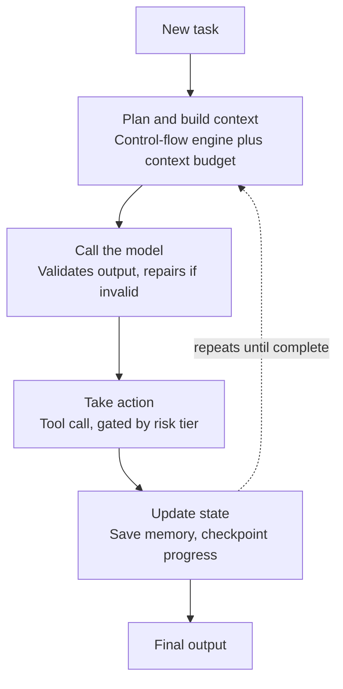
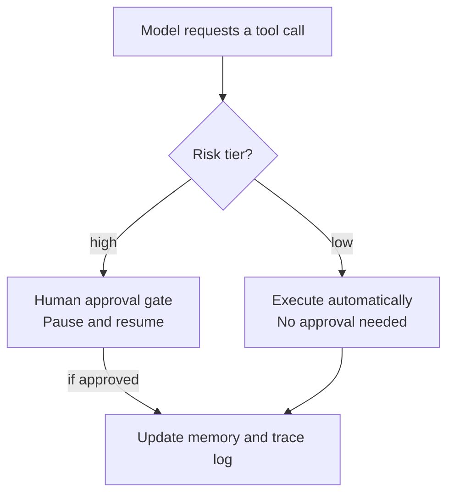
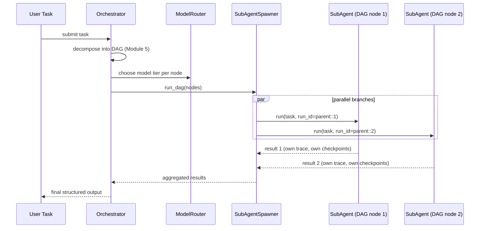
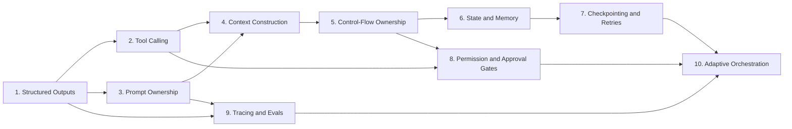

# The Agent-Harness Mastery Roadmap
### From Raw LLM Calls to a Production-Grade Agent Framework

---

## 0. How This Roadmap Works

You will build **one cohesive Python package**, `agent_harness/`, incrementally. Each module below is a real subpackage. By Module 10, all ten patterns compose into a single working framework — not ten disconnected demos.

**Rules of the build:**
- Standard library + `pydantic` + raw `openai`/`anthropic` SDK calls only, until Module 10 (where you may optionally wire in a router).
- No LangChain/LlamaIndex/AutoGen until you've built the mechanics by hand. Frameworks hide exactly the logic you're here to learn.
- Every module ends with a **Verification Test** you must pass before moving on. Treat it like a gate — don't skip ahead on vibes.

### Final Target Architecture

The harness is easiest to read as two views: the main loop, and a zoom-in on the one step that branches (taking an action). Cross-cutting systems (tracing, evals, orchestration) aren't drawn as crossing lines — they're listed in the table underneath, since each one simply attaches to a specific point in the loop rather than being a "step" itself.

**View 1 — the core loop.** Every task moves through the same five stages, looping back until it's done:



**View 2 — inside "Take action."** This is the only branching step: the harness checks risk tier before anything executes.



**Cross-cutting systems.** These don't sit inside the loop as steps — they attach to it from the side:

| System | Where it plugs in |
|---|---|
| **Tracer / Ledger** | Logs every box in both diagrams above — every model call, tool call, and gate decision |
| **Eval harness** | Grades only the *Final output* box, after a run completes |
| **Adaptive orchestrator** | Can spawn multiple copies of this *entire* loop in parallel, one per sub-task |

### Final Package Layout (grows module by module)

```
agent_harness/
├── __init__.py
├── schemas/            # M1: Pydantic contracts
├── tools/              # M2: tool registry + sandbox
├── prompts/            # M3: prompt-as-code + versioning
├── context/            # M4: budgeting, pruning, compression
├── control_flow/       # M5: state machine / DAG engine
├── memory/             # M6: sliding window + vector + durable store
├── persistence/        # M7: checkpointing + retries
├── gates/              # M8: HITL approval gates
├── tracing/            # M9: ledger + evals
├── orchestration/       # M10: routing + sub-agent spawning
├── framework.py         # ties everything together
└── tests/
    └── test_module_*.py # verification tests, one file per module
```

Each module section below gives you: **Concepts → Implementation Goal → Boilerplate skeleton → Failure Modes → Verification Test**. Code your own logic into the skeletons; don't just copy-paste and move on.

---

## Module 1 — Structured Outputs

**Key Architecture Concepts**
Raw LLM text completions are not a programming interface — they're a probability distribution over tokens. The harness's first job is turning that into a typed contract your code can trust. This is the foundation every other pattern sits on: tools, control-flow, and memory all assume the LLM's output already conforms to a schema.

**Implementation Goal**
Build `schemas/` with:
- Pydantic models for every structured response type your agent will ever emit (e.g. `AgentAction`, `AgentAnswer`).
- A `generate_structured(prompt, schema: type[BaseModel], max_repairs=3)` function that calls the LLM, requests JSON matching the schema (via native structured-output/tool-forcing if the API supports it, else via prompt instruction), attempts `schema.model_validate_json()`, and on `ValidationError`, feeds the error back to the model in a **repair loop** ("Your output failed validation: {error}. Return corrected JSON only.").

```python
# schemas/base.py
from pydantic import BaseModel, ValidationError

def generate_structured(client, model, prompt, schema: type[BaseModel], max_repairs: int = 3) -> BaseModel:
    messages = [{"role": "user", "content": prompt}]
    last_error = None
    for attempt in range(max_repairs + 1):
        raw = call_llm(client, model, messages, force_json=True)  # you implement call_llm
        try:
            return schema.model_validate_json(raw)
        except ValidationError as e:
            last_error = e
            messages.append({"role": "assistant", "content": raw})
            messages.append({
                "role": "user",
                "content": f"Your JSON failed schema validation:\n{e}\nReturn corrected JSON only, no prose."
            })
    raise RuntimeError(f"Structured output failed after {max_repairs} repairs: {last_error}")
```

**Failure Modes & Edge Cases**
- Model wraps JSON in markdown fences → validation silently fails unless you strip fences before parsing.
- Model "almost" matches schema (extra field, wrong enum casing) → naive `try/except` swallows the retry signal if you don't surface *which* field failed.
- Infinite repair loops on genuinely impossible instructions (contradictory schema) → hard cap + fallback to a degraded default is mandatory.
- Streaming responses truncate mid-JSON → must handle partial-JSON detection separately from schema-invalid JSON.

**Verification Test**
Force three consecutive malformed responses (mock the LLM call to return invalid JSON, then valid JSON on the 3rd try) and assert `generate_structured` returns a validated object and made exactly 3 calls. Then assert it raises cleanly after `max_repairs` all-invalid attempts.

---

## Module 2 — Tool Calling

**Key Architecture Concepts**
Tool calling turns your agent from a text generator into an actor. The harness's job is not "call the API's function-calling feature" — it's owning the **registry, argument validation, and execution boundary** so a hallucinated or malicious call can't touch your system uncontrolled.

**Implementation Goal**
Build `tools/`:
- `@tool` decorator that introspects a Python function's type hints to auto-generate the JSON schema the LLM sees (no manual schema duplication).
- A `ToolRegistry` mapping tool name → (callable, pydantic arg model).
- An **execution sandbox**: validate LLM-supplied args against the pydantic model *before* calling the function; catch and structure exceptions instead of letting them propagate; enforce timeouts.

```python
# tools/registry.py
import inspect, functools
from pydantic import create_model, ValidationError

class ToolRegistry:
    def __init__(self):
        self._tools = {}

    def tool(self, fn):
        sig = inspect.signature(fn)
        fields = {n: (p.annotation, ...) for n, p in sig.parameters.items()}
        arg_model = create_model(f"{fn.__name__}_Args", **fields)
        self._tools[fn.__name__] = (fn, arg_model)
        return fn

    def schema_for_llm(self) -> list[dict]:
        return [
            {"name": name, "parameters": model.model_json_schema()}
            for name, (_, model) in self._tools.items()
        ]

    def execute(self, name: str, raw_args: dict, timeout_s: float = 10.0) -> dict:
        fn, arg_model = self._tools[name]
        try:
            validated = arg_model.model_validate(raw_args)
        except ValidationError as e:
            return {"ok": False, "error": f"invalid_args: {e}"}
        try:
            result = run_with_timeout(fn, validated.model_dump(), timeout_s)  # implement via signal/thread
            return {"ok": True, "result": result}
        except Exception as e:
            return {"ok": False, "error": f"execution_error: {e}"}
```

**Failure Modes & Edge Cases**
- LLM calls a tool that doesn't exist (hallucinated name) → must return a structured error back into context, not crash the loop.
- LLM supplies extra/missing/wrong-typed args → caught by pydantic before Python ever sees them.
- Long-running or hanging tool calls (e.g. bad network call) → without timeouts, one tool call can hang your entire agent loop forever.
- Tool side effects on partial failure (e.g. writes to a DB then throws) → tools must be designed idempotent/transactional where possible.

**Verification Test**
Register a tool with a required `int` arg. Feed the registry `{"n": "not_a_number"}` and assert a structured `ok: False` error is returned, not an exception. Then register a tool that sleeps 5s with `timeout_s=1` and assert it returns a timeout error in ~1s, not 5s.

---

## Module 3 — Prompt Ownership

**Key Architecture Concepts**
Prompts are code, not strings buried in f-strings. Without ownership, prompt drift (someone edits a prompt in one place, breaks behavior everywhere) is undebuggable and unversioned. This module makes prompts first-class, diffable, testable artifacts.

**Implementation Goal**
Build `prompts/`:
- Prompt templates as versioned files (`.jinja` or plain `.txt` with `{var}` placeholders) — never inline strings in business logic.
- A `PromptTemplate` class: `render(**vars) -> {"system": ..., "user": ...}`, with strict variable checking (missing var = hard error, not silent blank).
- A version registry: every prompt has a semantic version; the framework logs which version produced which output (feeds Module 9's tracing).

```python
# prompts/template.py
from dataclasses import dataclass
from string import Template

@dataclass
class PromptTemplate:
    name: str
    version: str
    system_tmpl: str
    user_tmpl: str

    def render(self, **kwargs) -> dict:
        try:
            system = Template(self.system_tmpl).substitute(**kwargs)
            user = Template(self.user_tmpl).substitute(**kwargs)
        except KeyError as e:
            raise ValueError(f"Missing prompt variable {e} for {self.name}@{self.version}")
        return {"system": system, "user": user, "prompt_id": f"{self.name}@{self.version}"}

class PromptRegistry:
    def __init__(self):
        self._prompts: dict[str, dict[str, PromptTemplate]] = {}

    def register(self, tmpl: PromptTemplate):
        self._prompts.setdefault(tmpl.name, {})[tmpl.version] = tmpl

    def get(self, name: str, version: str = "latest") -> PromptTemplate:
        versions = self._prompts[name]
        return versions[max(versions)] if version == "latest" else versions[version]
```

**Failure Modes & Edge Cases**
- Silent variable substitution failures (e.g. Python f-strings just `KeyError` at runtime with no context) → must fail loud with prompt name+version attached.
- Two code paths rendering "the same" prompt slightly differently → centralization prevents drift.
- No rollback path when a new prompt version regresses quality → versioning must be additive (never overwrite), so you can pin/rollback.
- System/user boundary collapsed into one blob → loses model-level instruction-priority behavior and makes injection harder to reason about.

**Verification Test**
Render a template missing a required variable and assert a `ValueError` naming the exact prompt+version+variable. Register two versions of the same prompt name and assert `get(name, "v1")` and `get(name, "latest")` return different, correct templates.

---

## Module 4 — Context Construction

**Key Architecture Concepts**
The context window is a scarce, expensive, and order-sensitive resource. "Just concatenate everything" works until it doesn't — cost explodes, relevant info gets buried, and the model attends worse to the middle of long contexts. The harness must actively curate what goes in, not just append.

**Implementation Goal**
Build `context/`:
- A token counter (use `tiktoken` or the provider's counting endpoint) and a hard `budget` per call.
- A `ContextBuilder` that assembles context from prioritized sources (system prompt > current task > recent turns > retrieved memory > scratch), truncating/pruning lowest-priority items first when over budget.
- A summarization/compression step: when history exceeds a threshold, replace old turns with an LLM-generated summary rather than dropping them outright.

```python
# context/builder.py
from dataclasses import dataclass, field

@dataclass
class ContextBlock:
    name: str
    content: str
    priority: int   # lower = more important, kept first
    tokens: int

class ContextBuilder:
    def __init__(self, token_budget: int, count_tokens_fn):
        self.token_budget = token_budget
        self.count_tokens = count_tokens_fn
        self.blocks: list[ContextBlock] = []

    def add(self, name: str, content: str, priority: int):
        self.blocks.append(ContextBlock(name, content, priority, self.count_tokens(content)))

    def build(self) -> str:
        ordered = sorted(self.blocks, key=lambda b: b.priority)
        kept, used = [], 0
        for b in ordered:
            if used + b.tokens <= self.token_budget:
                kept.append(b)
                used += b.tokens
            else:
                kept.append(ContextBlock(b.name, f"[[{b.name} truncated: over budget]]", b.priority, 0))
        kept.sort(key=lambda b: b.priority)  # restore original section order for coherence
        return "\n\n".join(f"### {b.name}\n{b.content}" for b in kept)
```

**Failure Modes & Edge Cases**
- Silent truncation mid-sentence (character-based, not token-aware) → corrupts meaning; must truncate at block boundaries, not mid-string.
- "Lost in the middle" — critical instructions placed in the dead zone of a long context get ignored even though technically "in" the window.
- Summarization compounding error — summarizing a summary repeatedly drifts from ground truth; keep a raw log alongside the compressed view.
- Budget miscalculation from counting text tokens but forgetting tool-schema/system overhead → real API call rejected as over-limit.

**Verification Test**
Build a context with blocks totaling 2x the budget across 3 priority tiers; assert the highest-priority blocks are always present intact and the lowest-priority ones are the ones truncated. Assert total token count of the final string ≤ budget.

---

## Module 5 — Control-Flow Ownership

**Key Architecture Concepts**
An agent that just loops "call LLM → maybe call tool → repeat" until it *feels* done is nondeterministic and undebuggable. Owning control-flow means the **harness**, not the model, decides what states exist, what transitions are legal, and when to stop — the LLM only decides *which* legal transition to take.

**Implementation Goal**
Build `control_flow/`:
- A finite state machine (`State`, `Transition`) for deterministic phases (e.g. `PLANNING → EXECUTING → REVIEWING → DONE`).
- A DAG-based task graph for decomposable work, where nodes can run in parallel and edges encode dependencies.
- A hard **max-steps / max-loop-iterations** guard independent of what the model "wants" to do.

```python
# control_flow/state_machine.py
from dataclasses import dataclass, field
from enum import Enum, auto

class Phase(Enum):
    PLAN = auto(); EXECUTE = auto(); REVIEW = auto(); DONE = auto(); FAILED = auto()

@dataclass
class AgentFSM:
    phase: Phase = Phase.PLAN
    step_count: int = 0
    max_steps: int = 25
    transitions: dict = field(default_factory=lambda: {
        Phase.PLAN: {Phase.EXECUTE},
        Phase.EXECUTE: {Phase.REVIEW, Phase.EXECUTE},
        Phase.REVIEW: {Phase.EXECUTE, Phase.DONE, Phase.FAILED},
    })

    def step(self, requested_phase: Phase):
        self.step_count += 1
        if self.step_count > self.max_steps:
            self.phase = Phase.FAILED
            raise RuntimeError("max_steps exceeded — control-flow guard tripped")
        allowed = self.transitions.get(self.phase, set())
        if requested_phase not in allowed:
            raise ValueError(f"Illegal transition {self.phase} -> {requested_phase}")
        self.phase = requested_phase
```

**Failure Modes & Edge Cases**
- Model self-reports "DONE" prematurely (or never) → the FSM, not the model's claim, gates the actual transition; the model's output is a *proposal*, the FSM *approves*.
- Unbounded loops when a tool keeps failing the same way → max_steps guard is the only thing preventing runaway API spend.
- Race conditions in the DAG when two "independent" nodes actually share mutable state → must explicitly declare shared resources per node.
- Illegal transitions silently allowed (e.g. skipping REVIEW) → makes the whole guarantee of "deterministic phases" worthless.

**Verification Test**
Attempt an illegal transition (`PLAN → DONE`) and assert `ValueError`. Drive the FSM in a legal `EXECUTE → EXECUTE` loop past `max_steps` and assert it raises and lands in `FAILED`, never silently continuing.

---

## Module 6 — State and Memory

**Key Architecture Concepts**
Memory is not one thing — short-term working memory (this conversation), long-term semantic memory (vector retrieval over past knowledge), and durable state (facts that must survive process restarts) have different consistency, latency, and staleness requirements. Conflating them causes stale-context bugs and silent forgetting.

**Implementation Goal**
Build `memory/`:
- `SlidingWindowMemory`: keeps last N turns verbatim, oldest evicted (or handed to Module 4's compression).
- `VectorMemory`: embed + store text chunks, `retrieve(query, k)` via cosine similarity (use a simple in-memory numpy index before reaching for a real vector DB).
- `DurableStateStore`: key-value facts (e.g. user preferences, task status) persisted to disk/DB, read-through/write-through so it survives restarts — this is the bridge to Module 7's checkpointing.

```python
# memory/vector_memory.py
import numpy as np

class VectorMemory:
    def __init__(self, embed_fn):
        self.embed_fn = embed_fn
        self._texts: list[str] = []
        self._vectors: list[np.ndarray] = []

    def add(self, text: str):
        self._texts.append(text)
        self._vectors.append(np.array(self.embed_fn(text)))

    def retrieve(self, query: str, k: int = 3) -> list[str]:
        if not self._vectors:
            return []
        q = np.array(self.embed_fn(query))
        sims = [float(np.dot(q, v) / (np.linalg.norm(q) * np.linalg.norm(v) + 1e-9)) for v in self._vectors]
        top_idx = np.argsort(sims)[::-1][:k]
        return [self._texts[i] for i in top_idx]
```

**Failure Modes & Edge Cases**
- Sliding window silently drops a fact the agent still needs 10 turns later → this is why durable state and vector memory exist as separate tiers, not a patch on the window.
- Vector retrieval returning semantically-similar-but-factually-wrong chunks (embedding similarity ≠ correctness) → retrieval results should be labeled as "possibly relevant," not injected as ground truth.
- Durable state written but never invalidated → stale preferences override fresher user intent.
- Memory tiers disagreeing (durable store says X, vector memory recalls old text implying not-X) → need a precedence rule (durable > retrieved > conversational).

**Verification Test**
Add 5 texts to `VectorMemory` where only one is topically relevant to a query; assert `retrieve(query, k=1)` returns that one. Kill and reinstantiate `DurableStateStore` pointed at the same file/DB and assert previously-written keys are still readable (proves durability, not just an in-memory dict).

---

## Module 7 — Checkpointing & Safe Retries

**Key Architecture Concepts**
Long-running agent tasks *will* be interrupted — process crash, API timeout, rate limit. Without checkpointing, a failure means re-running from scratch (expensive, and can duplicate side effects like double-sending an email). This pattern makes the agent resumable from its last known-good state.

**Implementation Goal**
Build `persistence/`:
- A `Checkpoint` schema capturing: FSM phase, step count, memory state, pending tool calls — serialized after every step.
- `save_checkpoint(run_id, state)` / `load_checkpoint(run_id)` against a simple file or SQLite backend.
- Retry wrapper with **exponential backoff + jitter** for transient failures (rate limits, network errors), distinguishing retryable from fatal errors.

```python
# persistence/retry.py
import time, random

class FatalError(Exception): ...

def with_backoff(fn, max_retries=5, base_delay=1.0, max_delay=30.0):
    for attempt in range(max_retries):
        try:
            return fn()
        except FatalError:
            raise
        except Exception as e:
            if attempt == max_retries - 1:
                raise
            delay = min(max_delay, base_delay * (2 ** attempt)) * (0.5 + random.random())
            time.sleep(delay)
```

```python
# persistence/checkpoint.py
import json, pathlib

def save_checkpoint(run_id: str, state: dict, dir_="./checkpoints"):
    pathlib.Path(dir_).mkdir(exist_ok=True)
    pathlib.Path(f"{dir_}/{run_id}.json").write_text(json.dumps(state))

def load_checkpoint(run_id: str, dir_="./checkpoints") -> dict | None:
    p = pathlib.Path(f"{dir_}/{run_id}.json")
    return json.loads(p.read_text()) if p.exists() else None
```

**Failure Modes & Edge Cases**
- Retrying a non-idempotent tool call (e.g. "send email") blindly → duplicate side effects; retries must be scoped to the LLM/API call, not re-executed tool effects, unless the tool itself is idempotent (idempotency keys).
- Checkpointing too coarsely (once per whole task) → a crash still loses most of the work; checkpoint after every state-changing step.
- Retrying fatal errors (bad API key, malformed request) as if they were transient → wastes time/money; must classify error types.
- Checkpoint schema drift — old checkpoints become unloadable after you change your state shape → version your checkpoint schema too (ties back to Module 3's versioning discipline).

**Verification Test**
Simulate a function that fails twice then succeeds; assert `with_backoff` returns the success on the 3rd attempt with increasing delays. Save a checkpoint mid-FSM-run, "crash" (drop the in-memory object), reload from `load_checkpoint`, and assert the FSM resumes at the correct phase/step rather than restarting at PLAN.

---

## Module 8 — Permission & Approval Gates

**Key Architecture Concepts**
Not all agent actions carry equal risk. Reading a file and deleting a production database shouldn't go through the same unsupervised path. This pattern inserts a deterministic pause point where a human (or a higher-privilege policy) must approve before a high-risk action executes — and the harness must be able to actually *pause and resume*, not just log a warning after the fact.

**Implementation Goal**
Build `gates/`:
- A `RiskTier` enum (`LOW`, `MEDIUM`, `HIGH`) assigned per tool (extends Module 2's registry).
- An `ApprovalGate` that, for `HIGH` (and optionally `MEDIUM`) risk actions, serializes the pending action, halts execution, and waits for an external approve/deny signal — implemented first as a blocking CLI prompt, later as an async webhook/queue.
- Gate decisions get persisted (ties to Module 7) so a pending approval survives a restart.

```python
# gates/approval.py
from enum import Enum, auto
from dataclasses import dataclass

class RiskTier(Enum):
    LOW = auto(); MEDIUM = auto(); HIGH = auto()

@dataclass
class PendingAction:
    tool_name: str
    args: dict
    risk: RiskTier
    run_id: str

class ApprovalGate:
    def __init__(self, require_approval_at: RiskTier = RiskTier.HIGH, approver=None):
        self.require_approval_at = require_approval_at
        self.approver = approver or self._cli_approver

    def _cli_approver(self, action: PendingAction) -> bool:
        resp = input(f"[APPROVAL REQUIRED] {action.tool_name}({action.args}) risk={action.risk.name}. Approve? [y/N]: ")
        return resp.strip().lower() == "y"

    def check(self, action: PendingAction) -> bool:
        tiers = list(RiskTier)
        if tiers.index(action.risk) < tiers.index(self.require_approval_at):
            return True  # below threshold, auto-approved
        return self.approver(action)
```

**Failure Modes & Edge Cases**
- Approval prompt blocking the whole process indefinitely with no timeout or escalation path → design for async pause/resume, not just a blocking `input()` in production.
- Risk tier misassigned at tool-registration time (e.g. a "delete" tool marked LOW) → risk tiers need review as a first-class part of tool definition, not an afterthought.
- Approved-once, replayed-many — an approval token reused across multiple different calls → each pending action needs a unique id and single-use approval.
- Denial not fed back into agent reasoning → agent should get a structured "action denied by reviewer: {reason}" so it can adapt, not just retry the same denied action.

**Verification Test**
Register a HIGH-risk tool; call the gate with an `approver` stub that returns `False`; assert the action does not execute and the agent receives a structured denial. Then stub `approver` to return `True` and assert execution proceeds. Assert a LOW-risk action never invokes the approver at all.

---

## Module 9 — Tracing & Evals

**Key Architecture Concepts**
"It worked on my test run" is not evidence of a reliable system. Without a trace of every LLM call, tool call, and state transition — with cost and latency attached — you can't debug regressions, control spend, or prove behavior didn't silently drift. Evals turn "seems fine" into a repeatable, gradeable signal.

**Implementation Goal**
Build `tracing/`:
- A `TraceLedger` that logs every event (LLM call, tool call, state transition, gate decision) with timestamp, input/output, token counts, and cost estimate, keyed by `run_id`.
- An export format (JSONL) so traces are diffable and greppable, not locked in a UI.
- An `LLMJudge` eval harness: given a rubric + expected behavior, use a separate (ideally more capable, or at least independent-prompted) LLM call to score a completed trajectory, with the rubric itself stored as a versioned prompt (Module 3).

```python
# tracing/ledger.py
import time, json, pathlib
from dataclasses import dataclass, asdict, field

@dataclass
class TraceEvent:
    run_id: str
    event_type: str        # "llm_call" | "tool_call" | "transition" | "gate_decision"
    payload: dict
    tokens_in: int = 0
    tokens_out: int = 0
    cost_usd: float = 0.0
    ts: float = field(default_factory=time.time)

class TraceLedger:
    def __init__(self, path="./traces.jsonl"):
        self.path = pathlib.Path(path)

    def log(self, event: TraceEvent):
        with self.path.open("a") as f:
            f.write(json.dumps(asdict(event)) + "\n")

    def total_cost(self, run_id: str) -> float:
        total = 0.0
        for line in self.path.read_text().splitlines():
            e = json.loads(line)
            if e["run_id"] == run_id:
                total += e["cost_usd"]
        return total
```

**Failure Modes & Edge Cases**
- Logging only successes → the traces you need most (failures, near-misses) are exactly the ones missing.
- Cost tracking computed from wrong per-token pricing (stale rate table) → silent budget overruns.
- LLM-as-judge graded with a vague rubric → judge scores become noise; rubric must be as versioned/specific as any other prompt.
- Trace volume growing unbounded with no rotation/retention policy → traces themselves become an ops problem.

**Verification Test**
Run a fake multi-step trajectory, log 5 events with known costs, and assert `total_cost(run_id)` sums correctly and matches a hand-calculated total. Feed the `LLMJudge` two trajectories — one that satisfies a rubric and one that clearly violates it — and assert the scores are ordered correctly (violating trajectory scores lower).

---

## Module 10 — Adaptive Orchestration

**Key Architecture Concepts**
Not every subtask deserves your most expensive model, and not every task is solvable by one agent alone. This is the capstone pattern: the orchestrator dynamically **routes** work to the right model tier, and **spawns sub-agents** (each running the full Modules 1–9 harness) for decomposable work, coordinating a worker pool rather than one monolithic loop.

**Implementation Goal**
Build `orchestration/`:
- A `ModelRouter` that picks a model based on task complexity signals (e.g. estimated reasoning depth, prior failure rate on similar tasks, cost budget remaining) — cheap/fast model first, escalate on failure or low-confidence structured output.
- A `SubAgentSpawner` that takes a DAG node from Module 5, instantiates a fresh harness instance (own FSM, memory, trace ledger — all under a shared parent `run_id`), and runs it, aggregating results back to the parent.
- A worker pool (`asyncio` or `concurrent.futures`) to run independent DAG branches in parallel, respecting a global concurrency/cost cap.

```python
# orchestration/router.py
from dataclasses import dataclass

@dataclass
class ModelTier:
    name: str
    cost_per_1k: float
    capability_rank: int  # higher = more capable

class ModelRouter:
    def __init__(self, tiers: list[ModelTier]):
        self.tiers = sorted(tiers, key=lambda t: t.capability_rank)

    def choose(self, estimated_difficulty: int, prior_failures: int = 0) -> ModelTier:
        idx = min(estimated_difficulty + prior_failures, len(self.tiers) - 1)
        return self.tiers[idx]

    def escalate(self, current: ModelTier) -> ModelTier:
        idx = self.tiers.index(current)
        return self.tiers[min(idx + 1, len(self.tiers) - 1)]
```

```python
# orchestration/spawner.py
import concurrent.futures

class SubAgentSpawner:
    def __init__(self, harness_factory, max_workers=4):
        self.harness_factory = harness_factory  # () -> a fully wired Modules 1-9 agent
        self.max_workers = max_workers

    def run_dag(self, dag_nodes: list, parent_run_id: str) -> dict:
        results = {}
        with concurrent.futures.ThreadPoolExecutor(max_workers=self.max_workers) as pool:
            futures = {pool.submit(self._run_node, n, parent_run_id): n for n in dag_nodes}
            for fut in concurrent.futures.as_completed(futures):
                node = futures[fut]
                results[node.id] = fut.result()
        return results

    def _run_node(self, node, parent_run_id: str):
        agent = self.harness_factory()
        return agent.run(node.task, run_id=f"{parent_run_id}::{node.id}")
```



**Failure Modes & Edge Cases**
- Escalating to a bigger model on every failure without a cap → cost runaway defeats the purpose of tiered routing.
- Sub-agents spawned recursively without a depth limit → fork bomb of agents calling agents.
- Parallel DAG branches with hidden shared state (e.g. writing to the same file) → race conditions Module 5 warned about, now at process scale.
- Aggregation step assuming all sub-agent results are structurally identical → must validate each sub-result against a schema (Module 1) before merging.

**Verification Test**
Feed `ModelRouter.choose` increasing `estimated_difficulty`/`prior_failures` and assert it never selects a tier index beyond `len(tiers)-1` and monotonically escalates. Run `SubAgentSpawner.run_dag` with 5 independent nodes and a `max_workers=2` cap; assert all 5 complete, each produced its own trace file, and never more than 2 ran concurrently (instrument with a counter/lock in the mock harness).

---

## Build Order & Dependency Map



**Rationale for the order:**
1–3 give you reliable I/O contracts (typed outputs, safe tool execution, versioned prompts) before you build anything stateful.
4–5 turn those primitives into an actual reasoning loop with a real context budget and deterministic control.
6–7 make that loop stateful and crash-resilient.
8–9 add the safety and observability layers that only matter once there's a real loop worth trusting or auditing.
10 is the capstone: it composes 1–9 (a full harness) as the unit it routes and spawns.

---

## Capstone Integration Test

Once all ten modules exist, write one end-to-end test in `tests/test_capstone.py` that:
1. Submits a multi-step task requiring at least one tool call, one HIGH-risk action (triggering a gate), and enough steps to force at least one checkpoint.
2. Kills the process mid-run (simulate a crash after checkpoint N) and restarts from `load_checkpoint`.
3. Asserts the final output validates against your Module 1 schema.
4. Asserts the trace ledger contains a complete, gapless event history for the full run, with correct total cost.
5. Runs the `LLMJudge` against the final trajectory and asserts it clears your rubric threshold.

If that test passes deterministically across 3 runs, you have a working harness — not a demo.

---

## Suggested Pacing (self-paced, adjust freely)

| Phase | Modules | Focus |
|---|---|---|
| Week 1 | 1, 2, 3 | Typed I/O contracts, tool safety, prompt-as-code |
| Week 2 | 4, 5 | Context budgeting + deterministic control-flow |
| Week 3 | 6, 7 | Memory tiers + crash-resilient persistence |
| Week 4 | 8, 9 | HITL gates + full observability |
| Week 5 | 10 + Capstone | Routing, sub-agent pools, end-to-end proof |

---

### How to proceed with me from here

Tell me which module you want to start coding, and I'll do three things for each one you pick:
1. Review your implementation against the skeleton and failure modes above.
2. Stress-test it against the edge cases listed (I'll try to break it).
3. Confirm the Verification Test passes before we move to the next module.

Just paste your Module 1 code (or ask me to scaffold the full file structure first) and we'll start.
